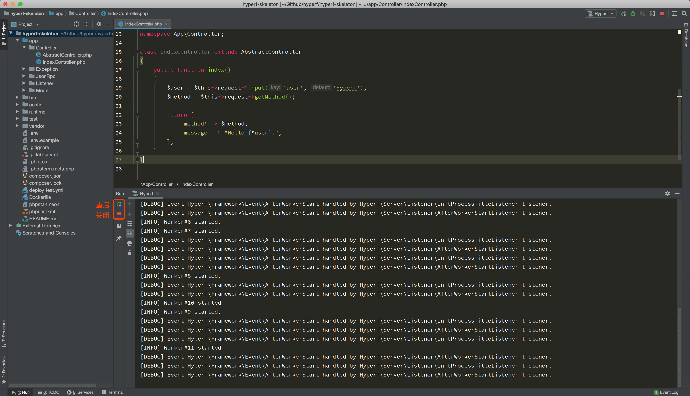
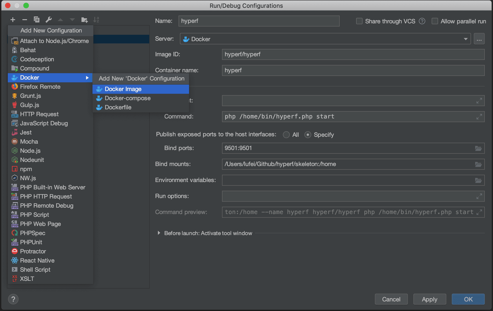
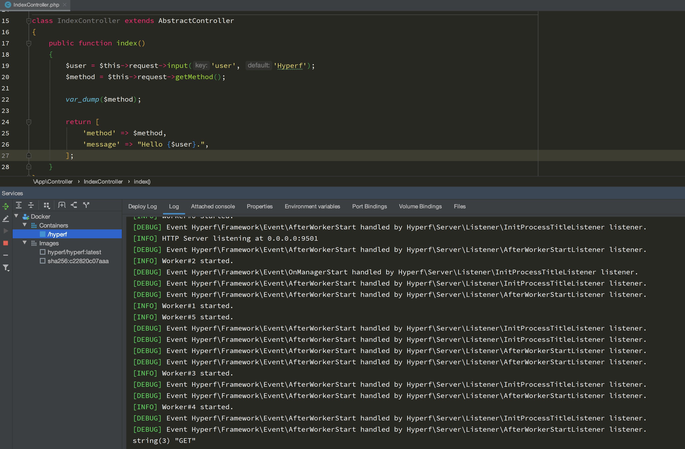

以下内容皆使用 PhpStorm 作为演示

## 快速启动/重启/停止服务

1. 点击 PhpStorm 右上角 Run 按钮旁边的`Add Configurations`

2. 点击 + 号添加一个`PHP Script`，填写对应的信息


对应信息说明：

```
Name：脚本名称，这里我们取名叫 Hyperf

File：脚本路径，我们选择 Hyperf 目录下，bin文件夹下的hyperf.php，路径为：YourProject/bin/hyperf.php
Arguments：脚本参数，这里我们填写 start 开启命令就行了，如果有需要可以写一些别的

Command Line
Interpreter options：解释器选项，这里默认不填写。如果你不想修改 php.ini 关闭短名称，可以填写-d swoole.use_shortname=Off
Custom Working directory：自定义工作目录，这里默认不填写
Environment variables：环境变量，这里默认不填写

Before launch：Activate tool window
启动前，我们需要做的事，默认不填写
```

3. 点击 Apply 保存即可，选中刚才配置的 Hyperf 脚本


4. 选中后在需要启动 Hyperf 服务时可以直接点击 Run 图标即可



也可以直接点击一键重启和关闭

## 在 Docker 中使用框架

Hyperf 对系统环境有一些要求，仅可运行于 Linux 和 Mac 环境下，但由于 Docker 虚拟化技术的发展，在 Windows 下也可以通过 Docker for Windows 来作为运行环境，通常来说 Mac 环境下，更推荐本地环境部署，以避免 Docker 共享磁盘缓慢导致 Hyperf 启动速度慢的问题。

### 拉取镜像

```bash
docker pull hyperf/hyperf
```

### 下载Hyperf Skeleton

```
composer create-project hyperf/hyperf-skeleton 
```

### 配置PhpStorm

和上文前两步一样，添加一个 Docker Image



保存之后就可以点击 Run 图标了



重启、关闭就不说了。。。