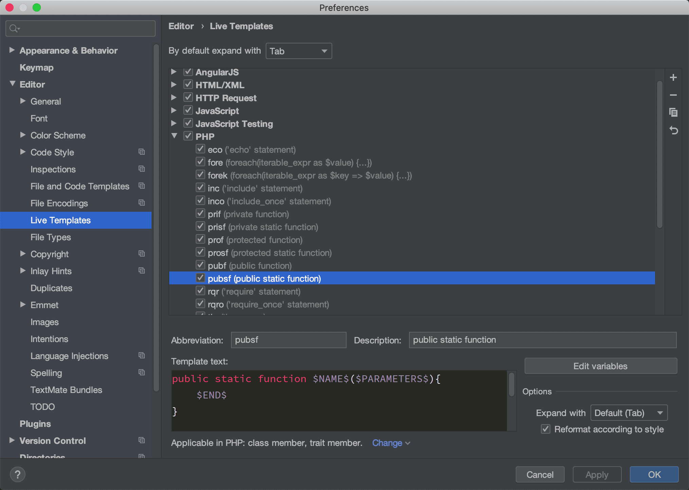

## 快捷键

1. `Command + Shift + A`

在 Windows 中的是 `Ctrl + Shift + A`，弹出一个动作查询窗口，输入操作或者工具的关键词就可以执行操作或打开工具

比如：需要打开 Terminal 工具，那么在窗口输入 ter ，按下`Enter`键，
那么就能打开 Terminal工具。

## Live Templates

快捷生成代码块、注释等。

设置 -> Editor -> Live Templates

## REST Client

点击 PhpStorm 上方的工具栏，找到 Tools 、 HTTP Client 、Test RESTful Web Service 点开后如图：

和 PostMan 类似，我们可以选择对应的请求方式、域名地址、接口路径

点击 Run 图标即可